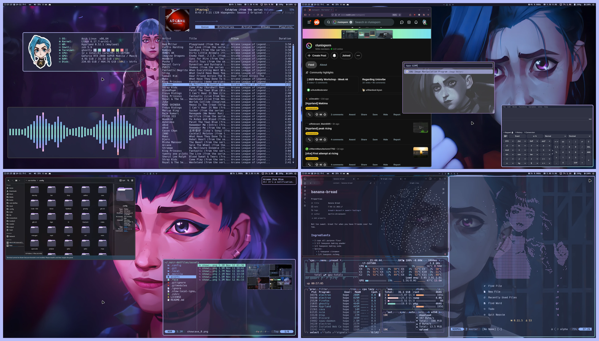
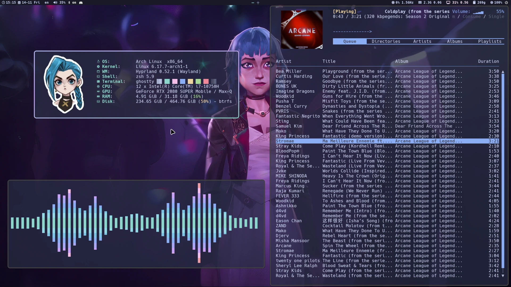
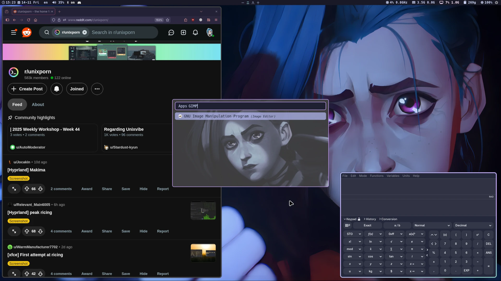
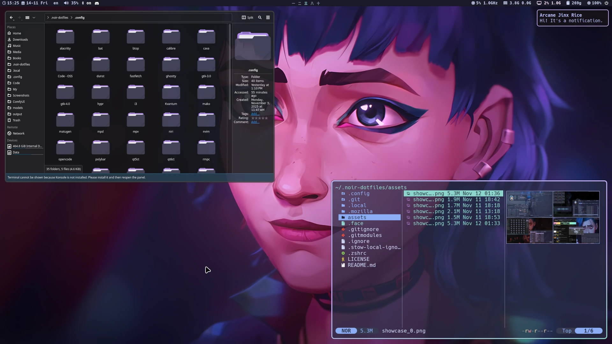
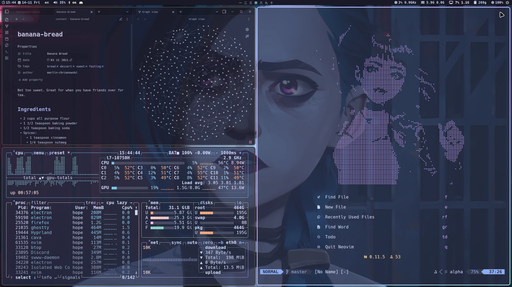
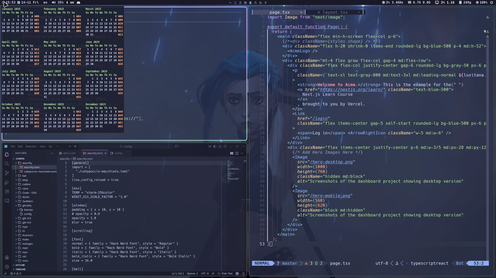
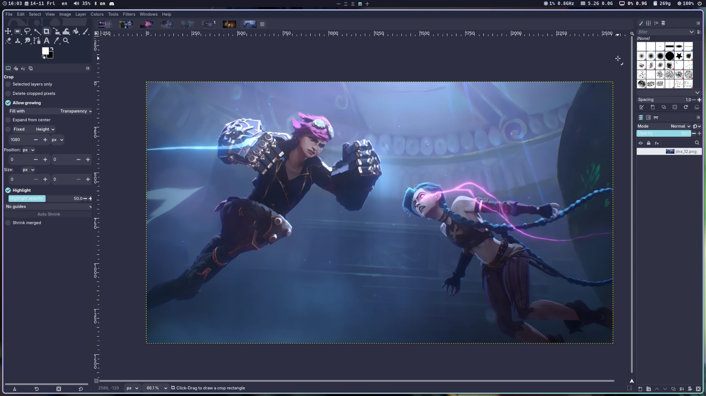

# About

  (WIP) This repo is a cozy home for scripts and configurations (aka .dotfiles) on my Linux setup. All tools are open-source and freely available, allowing you to use, modify, and share them as you like.

 

> 📝 NOTE: master branch corresponds to matugen version of the dotfiles. For
> catppuccin version refer to corresponding
> [catppuccin](https://github.com/imroux/rouxshell/tree/catppuccin) branch of
> this repo.

# Showcase

  

  
More screenshots

  

    
    
    
    
    
    
  

# Featured Software

|                   |                                                                                                                              |                                                   |
| ----------------- | ---------------------------------------------------------------------------------------------------------------------------- | ------------------------------------------------- |
| WM                | [Hyprland](https://github.com/hyprwm/Hyprland)                                                                               |                                                   |
| Bar + Widgets     | [Quickshell](https://quickshell.org/)                                                                                        |                                                   |
| File Manager      | [Yazi](https://github.com/sxyazi/yazi)                                                                                       | [Dolphin](https://github.com/KDE/dolphin)         |
| Music Player      | [RMPC](https://github.com/mierak/rmpc) + [MPD](https://github.com/MusicPlayerDaemon/MPD)                                     |                                                   |
| Editor            | [Neovim](https://github.com/neovim/neovim)                                                                                   | [VSCode](https://github.com/microsoft/vscode)     |
| Terminal          | [Kitty](https://github.com/kovidgoyal/kitty)                                                                                 | [Ghostty](https://github.com/ghostty-org/ghostty) |
| Shell             | Zsh +   [Zinit Plugin Manager](https://github.com/zdharma-continuum/zinit) +   [Starship Prompt](https://starship.rs/) |                                                   |
| Lockscreen        | hyprlock                                                                                                                     |                                                   |
| Wallpaper Manager | [SWWW](https://github.com/LGFae/swww)                                                                                        |                                                   |
| Wallpapers        | [Link](https://github.com/somanoir/noir-wallpapers)                                                                          |                                                   |
| Font              | [Hack Nerd Font](https://github.com/ryanoasis/nerd-fonts?tab=readme-ov-file)                                                 |                                                   |
| App Theme         | [Matugen](https://github.com/InioX/matugen) + [adw-gtk3](https://github.com/lassekongo83/adw-gtk3)                           |                                                   |
| Cursor Theme      | [Bibata](https://github.com/ful1e5/Bibata_Cursor)                                                                            |                                                   |
| Icon Theme        | [Tela-circle](https://github.com/vinceliuice/Tela-circle-icon-theme)                                                         |                                                   |

# Installation

I've made automated scripts to install all necessary packages and pull the
dotfiles on your machine. Make sure to read the instructions in their
corresponding repositories.

- [Arch](https://github.com/somanoir/noir-archinstall)
- [Fedora](https://github.com/somanoir/noir-fedorainstall)

# Known Issues

> On Fedora, packaged cava doesn't respect orientation = horizontal property.
> Building cava from source fixes the issue.
> (https://github.com/karlstav/cava?tab=readme-ov-file#from-source)

> On Fedora, initial launch of Steam requires the following env variable (launch
> from terminal): __GL_CONSTANT_FRAME_RATE_HINT=3 steam

# Feedback

- If you have any questions or suggestions regarding the project, feel free to
  join [Discussions](https://github.com/somanoir/.noir-dotfiles/discussions).
- Found a bug? Open an
  [Issue](https://github.com/somanoir/.noir-dotfiles/issues).

# Special thanks

I would like to express special thanks to the following people for their
tremendous work as well as direct and indirect contributions to this project:

- [mierak](https://github.com/mierak) for making a great TUI music player
  [rmpc](https://github.com/mierak/rmpc) and a multitude of helpful suggestions
  in setting up my config files for the player.
